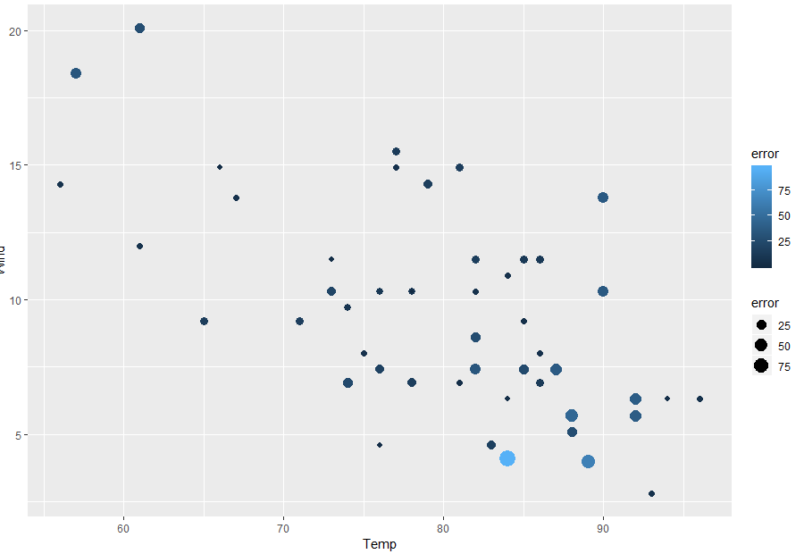
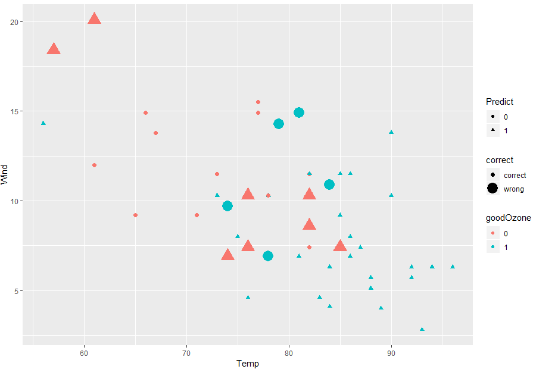

---

# Instructions
Conduct **predictive analytics** on the Air Quality dataset to predict changes in
`ozone` values.You will split the Air Quality dataset into a "**training set**" and
a "**test set**". Use various techniques, such as **Kernel-Based Support Vector Machines** (KSVM), **Support Vector Machines** (SVM), **Linear Modeling** (LM), and **Naive Bayes** (NB). 
Determine which technique is best for the dataset.

Add all of your packages that you use for this homework here in the library chunk.
```{r setup}
# Add your library below.
#install.packages("kernlab")
library(kernlab)
library(tidyverse)
#install.packages("Metrics")
library("Metrics")

#install.packages("e1071")
library(e1071)

#install.packages("gridExtra")
library(gridExtra)
```

# Step 1: Load the data (0.5 point)

Let's go back and analyze the air quality dataset (we used that dataset previously 
in the visualization lab). Remember to think about how to deal with the NAs in the data. 
Replace NAs with the mean value of the column.

```{r, "Step 1"}
# Write your code below.
airdata <- na.omit(airquality)
colSums(is.na(airdata))

airdata

```

---

# Step 2: Create train and test data sets (0.5 point)

Using techniques discussed in class (or in the video), create two datasets – 
one for training and one for testing.

```{r, "Step 2"}
# Write your code below.
# This bit of code is from the book page 235 on how to generate a randomized index that allow us to choose cases for our training and test sets

randIndex <- sample(1:dim(airdata)[1])
summary(randIndex)

cutPoint2_3 <- floor(2*dim(airdata)[1]/3)
cutPoint2_3


# training set

trainData <- airdata[randIndex[1:cutPoint2_3],]
str(trainData)
#test set
testData <- airdata[randIndex[(cutPoint2_3+1):dim(airdata)[1]],]
str(testData)

```

---

# Step 3: Build a model using KSVM and visualize the results (2 points)

## Step 3.1 - Build a model
Using `ksvm()`, create a model to try to predict changes in the `ozone` values. 
You can use all the possible attributes, or select the attributes that you think 
would be the most helpful. Of course, use the training dataset.

```{r, "Step 3.1"}
# Write your code below.
# Create Model based on our training data set
ksvmAir <- ksvm(Ozone ~., data=trainData, kernel="rbfdot",kpar="automatic",C=5,cross=3,prob.model=TRUE)
ksvmAir


```

## Step 3.2 - Test the model and find the RMSE
Test the model using the test dataset and find the **Root Mean Squared Error** (RMSE).
Root Mean Squared Error formula here:  
* http://statweb.stanford.edu/~susan/courses/s60/split/node60.html 

```{r, "Step 3.2"}
# Write your code below.


# Create a function that spits out the error % of our data.
OzoneModel <- function(A, airdata){
  OzoneModel <- predict(A, airdata)
  results <- table(OzoneModel, airdata$Ozone)
  print(results)
  Error <- (results[1,1]+results[2,2])/(results[1,1]+results[1,2]+(results[2,1]+results[2,2])*100)
  round(Error)
  return(Error)
}

OzoneModel(ksvmAir, airdata)
# Create a data set with the errors we generated. 
root <- function(error){
  sqrt(mean(error^2))
}

traindata.ksvm <- predict(ksvmAir, airdata)
ksvmError <- (airdata$Ozone - traindata.ksvm)
root(ksvmError)

# 13.08
```

## Step 3.3 - Plot the results. 
Use a scatter plot. Have the x-axis represent `Temp`, the y-axis represent `Wind`, 
the point size and color represent the error (as defined by the actual ozone level 
minus the predicted ozone level). It should look similar to this:




```{r, "Step 3.3"}
# Write your code below.


new.airdata <- data.frame(airdata$Wind, airdata$Temp, ksvmError)
  colnames(new.airdata) <- c("Wind", "Temp", "Error")


plotairdata <- ggplot(data = new.airdata,aes(x=airdata$Temp,y=airdata$Wind)) + geom_point(aes(size=ksvmError), color = "#56B4E9")


plotairdata

# This graph looks similar to the one posted in the instructions. It has a negative relationship between wind and temp. Higher temp. have less wind.  
```

## Step 3.4 - 1) Compute models 2) test the model using the test dataset and find the RMSE, and 3) plot the results for `svm()` and `lm()` the same way in the prior three steps. 
Use `svm()` from in the `e1071` package and `lm()` from Base R to computer two 
new predictive models. Generate similar charts for each model.

### Step 3.4.1 - Compute model/test the model/plot for `svm()`
```{r, "Step 3.4.1"}
# Write your code below.
# SVM air data
svmAir <- svm(Ozone ~., data=testData)
OzoneModel(svmAir,airdata)

traindata.svm <- predict(svmAir, airdata)
svmError <- (airdata$Ozone - traindata.svm)
root(svmError)

svm.airdata <- data.frame(airdata$Wind, airdata$Temp, svmError)
  colnames(svm.airdata) <- c("Wind", "Temp", "Error")


plotairdataSVM <- ggplot(data = svm.airdata,aes(x=airdata$Temp,y=airdata$Wind)) + geom_point(aes(size=svmError), color = "#56B4E9")
plotairdataSVM


```

### Step 3.4.2 - Compute model/test the model/plot for `lm()`
```{r, "Step 3.4.2"}
# Write your code below.
# LM air Data

lmAir <- lm(Ozone ~., data=testData)
OzoneModel(lmAir,airdata)

traindata.lm <- predict(lmAir, airdata)
lmError <- (airdata$Ozone - traindata.lm)
root(lmError)

lm.airdata <- data.frame(airdata$Wind, airdata$Temp, svmError)
  colnames(lm.airdata) <- c("Wind", "Temp", "Error")


plotairdatalM <- ggplot(data = lm.airdata,aes(x=airdata$Temp,y=airdata$Wind)) + geom_point(aes(size=lmError), color = "#56B4E9")
plotairdatalM

```

## Step 3.5 - Plot all three model results together
Show the results for the KSVM, SVM, and LM models in one window. Use the `grid.arrange()`
function to do this. All three models should be scatterplots. 

```{r, "Step 3.5"}
# Write your code below.
grid.arrange(plotairdata,plotairdataSVM,plotairdatalM)

```

---

# Step 4: Create a “goodOzone” variable (1 point)

This variable should be either 0 or 1. It should be 0 if the ozone is below the 
average for all the data observations, and 1 if it is equal to or above the 
average ozone observed. Pay attention to the binary factor variable (goodOzone) so you cannot 
use RMSE for calculating error for models you build using this data. 

```{r, "Step 4"}
# Write your code below.
#153 in airdata, 74 in traindata. I made in i in 74 since the next step requires us to use the traindata...

goodOzone <-c()
  for (i in 1:111) {
    if (airdata$Ozone[i] < mean(airdata$Ozone)){
    goodOzone<-append(goodOzone,0)
  }
  else goodOzone<-append(goodOzone,1)
  }

#adding the column in the dataframe
airdata<-data.frame(airdata,goodOzone)


```

---

# Step 5: Predict "good" and "bad" ozone days. (3 points)
Let's see if we can do a better job predicting “good” and “bad” days.

## Step 5.1 - Build a model 
Using `ksvm()`, create a model to try to predict `goodOzone`. 
You can use all the possible attributes, or select the attributes that you think 
would be the most helpful. Of course, use the training dataset.
```{r, "Step 5.1"}
# Write your code below.

trainData<-data.frame(airdata,goodOzone)

OzoneModel.Good <- function(G, trainData){
  OzoneModel.Good <- predict(G, trainData)
  results <- table(OzoneModel.Good, trainData$goodOzone)
  print(results)
  Error <- (results[1,1]+results[2,2])/(results[1,1]+results[1,2]+(results[2,1]+results[2,2])*100)
  round(Error)
  return(Error)
}

KSVMModel.Good <- ksvm(goodOzone~.,data=trainData)
OzoneModel.Good(KSVMModel.Good ,trainData)
GoodOzone <- OzoneModel.Good(KSVMModel.Good ,trainData)


```

## Step 5.2 - Test the model and find the percent of `goodOzone`
Test the model on the test dataset, and compute the percent of “goodOzone” that
was correctly predicted. Do not use RMSE here...
```{r, "Step 5.2"}
# Write your code below.

OzoneModel.Good(KSVMModel.Good, trainData)
# Create a data set with the errors we generated. 
root <- function(error){
  sqrt(mean(error^2))
}

traindata.ksvmGood <- predict(KSVMModel.Good, trainData)
ksvmError.Good <- (airdata$Ozone - traindata.ksvmGood)
root(ksvmError.Good)


```

## Step 5.3 - Plot the results
```
# determine the prediction is "correct" or "wrong" for each case,   

# create a new dataframe contains correct, temperature and wind, and goodZone

# change column names
  colnames(Plot_ksvm) <- c("correct","Temp","Wind","goodOzone","Predict")
# plot result using ggplot
```
Use a scatter plot. Have the x-axis represent `Temp`, the y-axis represent 
`Wind`, the shape representing what was predicted (good or bad day), the color 
representing the actual value of `goodOzone` (i.e. if the actual ozone level was
good) and the size represent if the prediction was correct (larger symbols should 
be the observations the model got wrong). The plot should look similar to this:



```{r, "Step 5.3"}
# Write your code below.

new.Goodairdata <- data.frame(GoodOzone,airdata$Temp, airdata$Wind, airdata$goodOzone, ksvmError.Good)
  colnames(new.Goodairdata) <- c("correct","Temp","Wind","goodOzone","Predict")


plotairdata.Good <- ggplot(data = new.Goodairdata,aes(x=Temp,y=Wind)) + geom_point(aes(size="ksvmError.Good"), color = "#56B4E9")


plotairdata.Good

```

## Step 5.4 - Compute models and plot the results for ksvm, svm, and nb
Build a model using ksvm, svm, nb functions, and use all other variables to predict.    
Use `svm()` and `naiveBayes()` from in the e1071 package.

### Step 5.4.1 - Build a model using the `ksvm()` function,and use all other variables to predict.
```{r, "Step 5.4.1"}
# Write your code below.
KSVMModel.Good <- ksvm(goodOzone~.,data=trainData)
plotairdata.GoodKSVM <- ggplot(data = new.Goodairdata,aes(x=airdata$Temp,y=airdata$Wind)) + geom_point(aes(size="Predict"), color = "#56B4E9")
plotairdata.Good

```

### Step 5.4.2 - Test the model: Predict the new values from the test data and save the results as a new object. 
Create a dataframe that contains the exact "goodOzone" value and the predicted "goodOzone".  
Compute the percentage of correct cases
```{r, "Step 5.4.2"}
# Write your code below.

Correct.PredictedOzones <- data.frame(traindata.ksvmGood, ksvmError.Good)
  colnames(Correct.PredictedOzones) <- c("Correct","Predict")

  
  
```


# Step 5.4.3	Plot the results. 
Determine whether the prediction is "correct" or "wrong" for each case
Plot results using ggplot.
Size representing correct/wrong; color representing actual good/bad day; shape representing predicted good/bad day.
  
```{r, "Step 5.4.3"}
# Write your code below.

  Correct.PredictedOzones.Plot <- ggplot(data = Correct.PredictedOzones,aes(x=Correct,y=Predict))
Correct.PredictedOzones.Plot
  

```


# Step 5.4.4 - Compute models and plot the results for "svm" and "nb" 
Do the same three steps as above for "svm"-- `svm()` and "nb"-- `naiveBayes()`: 
1) build models, 2) test the model, 3) plot the results.

```{r, "Step 5.4.4"}
# Write your code below.
SVMModel.Good <- svm(goodOzone ~ ., data = airdata)
OzoneModel.Good(SVMModel.Good, airdata)

SVMModel.Good.first <- predict(SVMModel.Good, airdata)
SVMModel.Good.error <- (airdata$goodOzone - SVMModel.Good.first)
root(SVMModel.Good.error)

SVMDF<- data.frame(airdata$Wind,airdata$Temp,SVMModel.Good.error)
colnames(SVMDF) <- c("Wind","Temp","Error")
SVMDF.Plot <- ggplot(data = SVMDF,aes(x=airdata$Temp,y=airdata$Wind)) + geom_point(aes(size=SVMModel.Good.error), color = "lightblue") + ggtitle("SVM Model")
SVMDF.Plot


# NaivBayes

NaivBayesModel <- naiveBayes(goodOzone ~ ., data = airdata)
OzoneModel.Good(NaivBayesModel, airdata)

NaivBayesModel.Error <- predict(NaivBayesModel, airdata)

NaivBayesDF <- data.frame(airdata$goodOzone)
NaivBayesModel.Predicted <- predict(NaivBayesModel, NaivBayesDF)
NaivBayesModel.Predicted

NaivBayesDF.2 <- data.frame(airdata$Wind,airdata$Temp,NaivBayesModel.Error)
colnames(NaivBayesDF.2) <- c("Wind","Temp","Error")

NaivBayesDF.Plot <- ggplot(data = NaivBayesDF.2,aes(x=airdata$Temp,y=airdata$Wind)) + geom_point(aes(size=NaivBayesModel.Error), color = "Purple") + ggtitle("SVM Model")
NaivBayesDF.Plot
```

## Step 5.5 - Plot all three model results together
Show the results for the KSVM, SVM, and NB models in one window. Use the `grid.arrange()`
function to do this. All three models should be scatterplots. 

```{r, "Step 5.5"}
# Write your code below.

grid.arrange(plotairdata.GoodKSVM,SVMDF.Plot, NaivBayesDF.Plot, ncol = 2)

```


---

# Step 6: Which are the best Models for this data? (2 points)

Review what you have done (pay attention the visualization as well as the RMSE in step 3 
and accuracy calculation in step 5) and state which is the best and why. 
Please show the comparison of those error calculation results from Step 3 and Step 5 here.  

> [ There is a very small difference in the way of variance. They look similar enough and share the same patterns. The KSVM is a better fit since we are limited with svm on what it is able to model therefore KSVM would be a better fit for us as a analyst on this project.  ]

# Step 7: Upload your compiled file. (1 point)
Your compiled file should contain the answers to the questions.