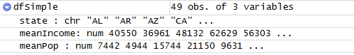
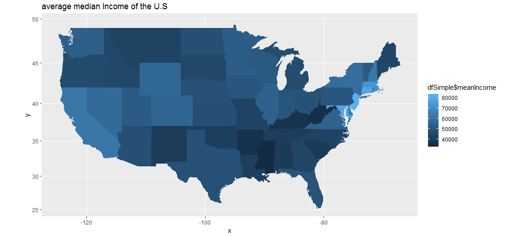
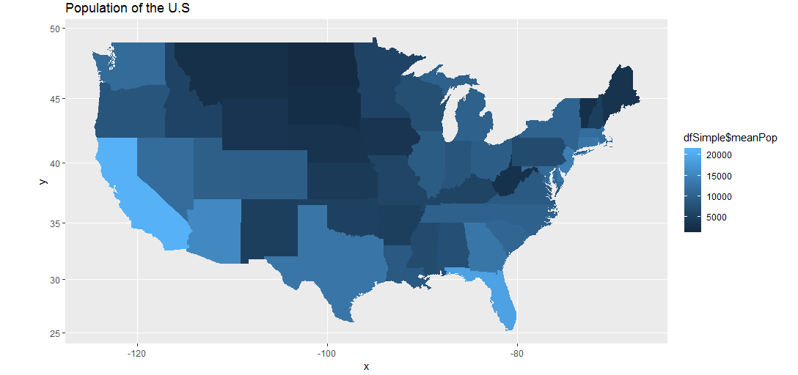
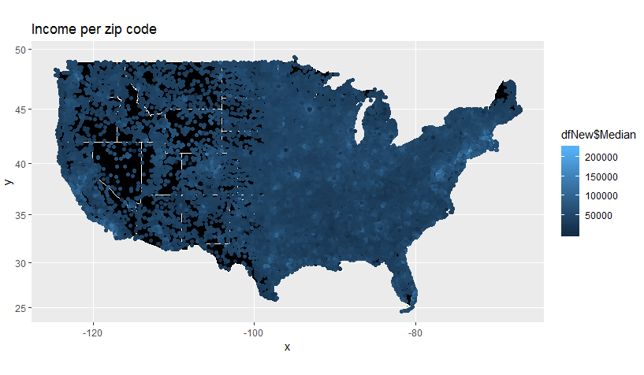
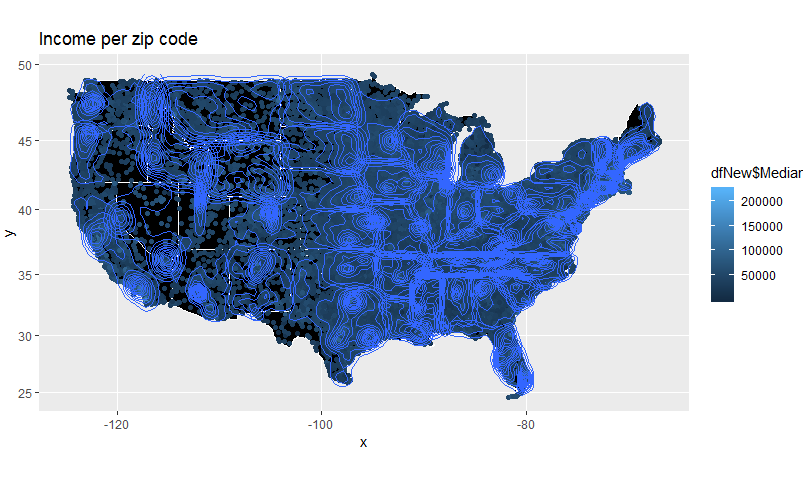

---

# Instructions

> **Warning: Do not copy and paste any code I give out here. You MUST write them up.** 
**If you copy and paste code from here to your RStudio, you will receive errors.** 

Download the dataset that has median income by zip code (an excel file) from:

- https://www.psc.isr.umich.edu/dis/census/Features/tract2zip/

Save the .xlsx file in this project's data folder.

---


# Step 1 - Load the Data

## Step 1.1 - Read the data 

Read the data using the `gdata` package we have previously used. 
Install the gdata package and load it.
Read the `MedianZIP.xlsx`, use the proper function, and save it as `mydata`. 
If you need a new package to do this, you may need to install the new package too. 
Try what works. There are so many ways to do this.

```{r, "Step 1.1"}
# Write your code below.
#install.packages("gdata")
#install.packages("readxl")
library(gdata)
library(readxl)

mydata <- read_excel("C:/Users/arenc/Desktop/Intro_Data_Munging/week4/week4_HW/MedianZIP-3.xlsx")


```

## Step 1.2 - Clean the data 

Clean up the dataframe if needed and make sure the column names are `zip`, `median`, 
`mean`, `population`. Make sure the values in each column are "numeric". 
If they are factors or characters, you must change them to quantitative data.

```{r, "Step 1.2"}
# Write your code below.
#install.packages("dplyr")
library(dplyr)


mydata <- rename(mydata, zip = Zip)
mydata <- rename(mydata, median = Median)
mydata <- rename(mydata, mean = Mean)
mydata <- rename(mydata, population = Pop)


```

## Step 1.3 - Load library and data

1. Load the `zipcode` package (install the `zipcode` package first).
The zipcode package can be installed by doing the following.

```
install.packages("remotes")
library(remotes)
install_version("zipcode", "1.0")
library(zipcode)
```

2. Use `data(zipcode)` to load a dataframe that contains `city`, `state`, 
`latitude`, and `longitude` for US zip codes.
3. Double-check your environment to find the `zipcode` dataframe with five variables 
and 44336 rows.

```{r, "Step 1.3"}
# Write your code below.
#install.packages("remotes")
#library(remotes)
#install_version("zipcode", "1.0")
library(zipcode)


zipcodes <- data(zipcode)

#sapply(zipcode, class)
```

## Step 1.4 - Merge the data

Merge the zipcode information from the two dataframes (merge into one dataframe). 

1. First, clean up and standardize the zipcodes in `mydata` using the `clean.zipcodes()`
function, and save the values to the `zip` column of `mydata`.
2. Merge `mydata` and `zipcode` by the common column `zip` and store the new 
dataframe as `dfNew`.
3. use the `merge()` function for this.

```{r, "Step 1.4"}
# Write your code below.

clean.zipcodes(mydata$zip)
mydata$zip <- clean.zipcodes(mydata$zip)

#?merge()
dfNew <- merge(x=mydata,y=zipcode, by="zip")


```

## Step 1.5 - Clean the data again

Remove Hawaii and Alaska (just focus on the “lower 48” states). 
**HINT**: You can use the `which()` function we learned from Intro to Data Science 
or you can use dplyr to filter the proper rows (use of course the `filter()` function 
in the dplyr package).

- After removing the two states, you should have 32321 rows in your new dataframe. 
(`mydata` has 32634 rows in it.) 

```{r, "Step 1.5"}
# Write your code below.

dfNew$state <- as.character(dfNew$state)
dfNew <- dfNew[dfNew$state != "AK", ]
dfNew <- dfNew[dfNew$state != "HI", ]


```

---

# Step 2 - Show the income and population per state

## Step 2.1 - Create a simpler dataframe

Create a simpler dataframe (call it `dfSimple`), with just the average median income 
and the population for each state.

- There are many ways to do this. But the simplest way is by using dplyr. 
Use `group_by()` and `summarize()` from "dplyr" to do this.
- The new dataframe should look like this:



```{r, "Step 2.1"}
# Write your code below.

library(dplyr)

avgmed <- tapply(as.numeric(dfNew$median), dfNew$state,mean)
totalpop <- tapply(as.numeric(dfNew$population), dfNew$state,sum)
dfSimple <- data.frame(avgmed,totalpop)
states <- sort(unique(dfNew$state))
dfSimple <- data.frame(avgmed,totalpop,states)


```

## Step 2.2 - Update columns

Add the state abbreviations and the state names as new columns 
(make sure the state names are all lower case).

1. Get the state name (not just the abbreviations). 
Use the built-in `state.name` and `state.abb` datasets. 
This is the code: 
``dfSimple$stateName <- state.name[match(dfSimple$state, state.abb)]``
2. Convert `stateName` to lowercase and save the values in the `stateName` column.

```{r, "Step 2.2"}
# Write your code below.

dfSimple$stateName <- state.name[match(dfSimple$state, state.abb)]

```

## Step 2.3 - Visualize the US (pt1)

Show the U.S. map, using color to represent the average median income of each state.

1. Get the data on the state to be mapped. 
Use `map_data()` function to read `"state"` object and save the result as `us`.
2. Use `dfSimple` to create a map and set `stateName` as `map_id`.
(follow the course content practice, written in the textbook and in the video). 

It should look like this (please do not forget to add the title of the map):



```{r, "Step 2.3"}
# Write your code below.
library("mapproj")
library(tidyverse)
us <- map_data('state')

dummyDF <- data.frame(state.name, stringsAsFactors=FALSE)
dummyDF$state <- tolower(dummyDF$state.name)


dfStates <- mydata

dfSimple$stateName <- tolower(dfSimple$stateName)


map.incomeColor <- ggplot(dfSimple,aes(map_id=stateName))
map.incomeColor <- map.incomeColor + geom_map(map = us, aes(fill=avgmed))
map.incomeColor <- map.incomeColor + expand_limits(x = us$long, y = us$lat)
map.incomeColor <- map.incomeColor + coord_map() + ggtitle("Median Income of US")
map.incomeColor


```

## Step 2.4 - Visualize the US (pt2)

Create a second map with color representing the population of the state.
It should look like this:



```{r, "Step 2.4"}
# Write your code below.
#require("mapproj")
#library("ggplot2")

#install.packages("reticulate")
#library(reticulate)
#py_install("pandas")


map.popColor <- ggplot(dfSimple,aes(map_id=stateName))
map.popColor  <- map.popColor  + geom_map(map = us, aes(fill=totalpop))
map.popColor  <- map.popColor  + expand_limits(x = us$long, y = us$lat)
map.popColor  <- map.popColor  + coord_map() + ggtitle("Mean Pop of US")
map.popColor 


```

---

# Step 3 - Show the income per zip code

Draw each zipcode on the map, where the color of the “dot” is based on the median income. 
To make the map look appealing, set the background of the map to black.

- Use `dfNew` to create a map and set `stateName` as the map ID
- Set the background color to black and line color to white
- Change the limits of the x and y axes to print the whole map (`expand_limits`)
- Plot points on map, where each "dot" represents a zipcode and the color of the
"dots" is based on median income (`geom_point`, use `color` attribute using `Median` value).

The graph should look like this:



```{r, "Step 3"}
# Write your code below.

# <- ggplot(dfNew,aes(map_id=state))
#map.newdf  <- map.newdf  + geom_map(map = us, aes(fill=totalpop))
#map.newdf  <- map.newdf  + expand_limits(x = us$long, y = us$lat)
#map.newdf  <- map.newdf  + coord_map() + ggtitle("Mean Pop of US")

us <- map_data("state")

dummyDF <- data.frame(state.name,stringsAsFactors = FALSE)
dummyDF$state <- tolower(dummyDF$state.name)

head(dummyDF)

map.simple <- ggplot(dummyDF, aes(map_id = state))
map.simple <- map.simple + geom_map(map = us, fill = "black", color="white")
map.simple <- map.simple + expand_limits(x = us$long, y= us$lat)
map.simple <- map.simple + coord_map() + ggtitle("Basic map of Continental USA")
map.simple


zipmap <- map.simple + geom_point(data=dfNew,aes(x=longitude, y = latitude, color=median)) + ggtitle("Income per Zip Code")
zipmap
#library(RColorBrewer)

#dfNew$mincome <- factor(dfNew$median,levels = c("1-50,000", "50,001-100,000", "100,001 - 150,000", "150,001 - 200,000+"))
#dumSizes <- length(levels(dfNew$mincome))


#od.companies$sizes <- factor(od.companies$full_time_employees,levels = c("1-10", "11-50", "51-200", "201-500", "501-1,000", "1,001-5,000","5,001-10,000", "10,001+"))


#is.numeric(dfNew$median)

```

---

# Step 4 - Show zip code density

Now generate a different map, one where we can easily see where there are lots of 
zipcodes and where there are few (using the `stat_density2d()` function). 
We will name this as `mapD`.

It should look like this: 



```{r, "Step 4"}
# Write your code below.

# Although i have a map similar to the provided example I am unable to get it exact. Patricia & Connor's chat in the "Raise your hand" assignment helped get me close by increasing 
# the bins value to get it close. I tried researching all the errors for this one but didnt have any luck finding a solution.. 

mapd <- zipmap + stat_density_2d(data=dfNew,aes(x=longitude,y=latitude,color=median), alpha = .5, bins = 120)
mapd


```

---

# Step 5 - Zoom in to the region around NYC

Repeat steps 3 and 4, but have the image/map of the northeast U.S. (centered around New York). 

Below I am giving out the code for this:

```
# use geocode function to get latitude and longtitude of NYC
latlon <- geocode("NYC, ny")

# create the first zoomed map based on "mapZip", and plot a point representing NYC
mapZipZoomed <- mapZip + geom_point(aes(x = latlon$lon, y = latlon$lat), color="darkred", size = 3)
# zoom into the region arount NYC with 10 degrees latitude and longtitude fluctuation (+/- 10)
mapZipZoomed <- mapZipZoomed + xlim(latlon$lon-10, latlon$lon+10) + ylim(latlon$lat-10,latlon$lat+10) + coord_map()
# plot the map
mapZipZoomed

# create the first zoomed map based on "mapD" and plot a point, which representing NYC
mapDZoomed <- mapD + geom_point(aes(x = latlon$lon, y = latlon$lat), color="darkred", size = 3)
# zoom into the region arount NYC (latitude and longtitude +/- 10)
mapDZoomed <- mapDZoomed + xlim(latlon$lon-10,latlon$lon+10) + ylim(latlon$lat-10,latlon$lat+10) + coord_map()
# plot the map
mapDZoomed
```

```{r, "Step 5"}
# Write your code below.
library(ggmap)

latlon <- geocode("NYC, ny")

mapZipZoomed <- zipmap + geom_point(aes(x = latlon$lon, y = latlon$lat), color="darkred", size = 3)
mapZipZoomed
mapZipZoomed <- mapZipZoomed + xlim(latlon$lon-10, latlon$lon+10) + ylim(latlon$lat-10,latlon$lat+10) + coord_map() + ggtitle("New York")
mapZipZoomed

#require("ggplot2")
#library(ggplot2)

mapDZoomed <- mapd + geom_point(aes(x = latlon$lon, y = latlon$lat), color="darkred", size = 3)
mapDZoomed

mapDZoomed <- mapDZoomed + xlim(latlon$lon-10,latlon$lon+10) + ylim(latlon$lat-10,latlon$lat+10) + coord_map() + ggtitle("New York")

mapDZoomed


?xlim

```