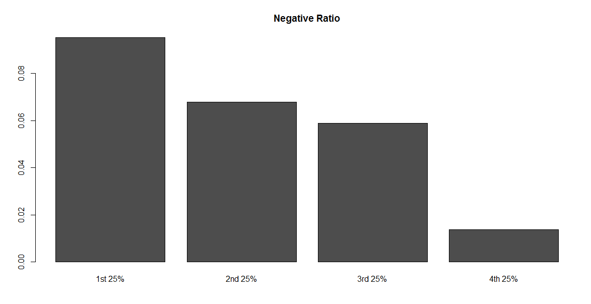
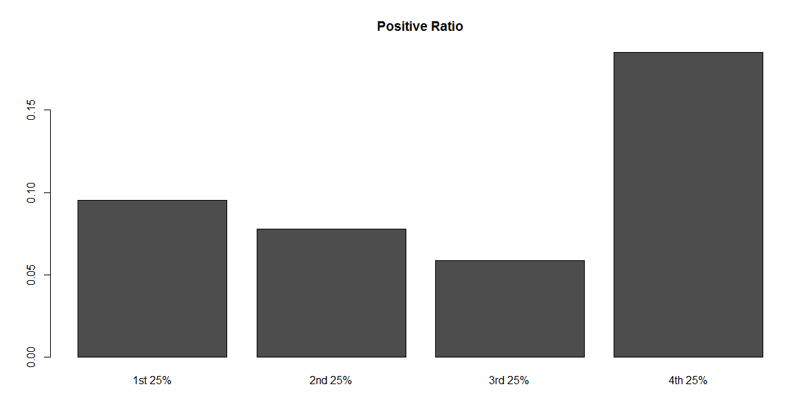

---

# Instructions
Conduct sentiment analysis on MLK's speech to determine how positive/negative
his speech was. Split his speech into four quartiles to see how that sentiment 
changes over time.Create two bar charts to display your results.

---

```{r setup, message = FALSE}
# Add your library below.


```

# Step 1 - Read in the Bing Dictionary
Sentiment analysis relies on a “dictionary”. Most dictionaries categorize words as either positive or negative, but some dictionaries use emotion (such as the NRC EmoLex Dictionary). Each dictionary is different. This assignment will introduce you to the **Bing dictionary**, which researchers created by categorizing words used in online reviews from Amazon, Yelp, and other similar platforms.

## Step 1.1 - Find the files
The files needed for this lab are stored in a RAR file. You must extract the files from the compressed RAR file by using a third-party application, such as 7Zip, winZip, or another program. Use google to find a RAR file extractor.

Find the RAR file on the UIC website (contains two text files: positive words and negative words). Ths file is about halfway down the page, listed as “A list of English positive and negative opinion words or sentiment words”. Use the link below:

* http://www.cs.uic.edu/~liub/FBS/sentiment-analysis.html  

Save these files in your "data" folder. 

```{r, "Step 1.1"}
# No code necessary; Save the files in your project's data folder.
```

## Step 1.2 - Create vectors
Create two vectors of words, one for the positive words and one for the 
negative words.

```{r, "Step 1.2"}
# Write your code below.


```

## Step 1.3 - Clean the files
Note that when reading in the word files, there might be lines at the start 
and/or the end that will need to be removed (i.e. you should clean your dataset).

```{r, "Step 1.3"}
# Write your code below.


```


---


# Step 2: Process in the MLK speech
Text is stored in many different formats, such as TXT, CSV, HTML, and JSON. In this lab, you are going to experience how to “parse HTML” for text analysis.

## Step 2.1 - Find and read in the file.
Find MLK’s speech on the AnalyticTech website. You can either read in the file using the XML package, or you can copy/paste the document into a TXT file.

Use the link below:

* http://www.analytictech.com/mb021/mlk.htm  


```{r, "Step 2.1"}
# Write your code below.


```

## Step 2.2 - Parse the files
If you choose to read the raw HTML using the XML package, you will need to parse the HTML object. For this exercise, we can split the HTML by the paragraph tag and then store the paragraphs inside a vector. The following code might help:

```
# Read and parse HTML file

doc.html = htmlTreeParse('http://www.analytictech.com/mb021/mlk.htm', 
                         useInternal = TRUE)

# Extract all the paragraphs (HTML tag is p, starting at
# the root of the document). Unlist flattens the list to
# create a character vector.

doc.text = unlist(xpathApply(doc.html, '//p', xmlValue))

# Replace all \n by spaces
doc.text = gsub('\\n', ' ', doc.text)

# Replace all \r by spaces
doc.text = gsub('\\r', ' ', doc.text)
```

```{r, "Step 2.2"}
# Write your code below, if necessary.


```

## Step 2.3 - Transform the text
Text must be processed before it can be analyzed. There are many ways to process text. This class has introduced you to two ways:

* Using the TM package to manipulate term-document matrices
* Using the tidytext package to unnest tokens

Either create a **term-document matrix** or **unnest the tokens**.

```{r, "Step 2.3"}
# Write your code below.


```
## Step 2.4 - Create a list of word frequencies
Create a list of counts for each word.

```{r, "Step 2.4"}
# Write your code below.


```

---

# Step 3: Positive words
Determine how many positive words were in the speech. Scale the number based on 
the total number of words in the speech. 
**Hint:** 
One way to do this is to use `match()` and then `which()`. If you choose the tidyverse method, try `group_by()` and then `count()`.

```{r, "Step 3"}
# Write your code below.


```

---

# Step 4: Negative words
Determine how many negative words were in the speech. Scale the number based on the total number of words in the speech.  
**Hint:** 
This is basically the same as Step 3.

```{r, , "Step 4"}
# Write your code below.


```

---

# Step 5: Get Quartile values
Redo the “positive” and “negative” calculations for each 25% of the speech by
following the steps below.

## 5.1 Compare the results in a graph
Compare the results (e.g., a simple bar chart of the 4 numbers).  
For each quarter of the text, you calculate the positive and negative ratio, 
as was done in Step 4 and Step 5.  
The only extra work is to split the text to four equal parts, then 
visualize the positive and negative ratios by plotting. 

The final graphs should look like below:  



**HINT:** 
The code below shows how to start the first 25% of the speech.
Finish the analysis and use the same approach for the rest of the speech.

```
# Step 5: Redo the positive and negative calculations for each 25% of the speech
  # define a cutpoint to split the document into 4 parts; round the number to get an interger
  cutpoint <- round(length(words.corpus)/4)
 
# first 25%
  # create word corpus for the first quarter using cutpoints
  words.corpus1 <- words.corpus[1:cutpoint]
  # create term document matrix for the first quarter
  tdm1 <- TermDocumentMatrix(words.corpus1)
  # convert tdm1 into a matrix called "m1"
  m1 <- as.matrix(tdm1)
  # create a list of word counts for the first quarter and sort the list
  wordCounts1 <- rowSums(m1)
  wordCounts1 <- sort(wordCounts1, decreasing=TRUE)
  # calculate total words of the first 25%
```

```{r}
# Write your code below.


```

# 5.2 Analysis

What do you see from the positive/negative ratio in the graph? 
State what you learned from the MLK speech using the sentiment analysis results: 

> [ Type your analysis here. ]

